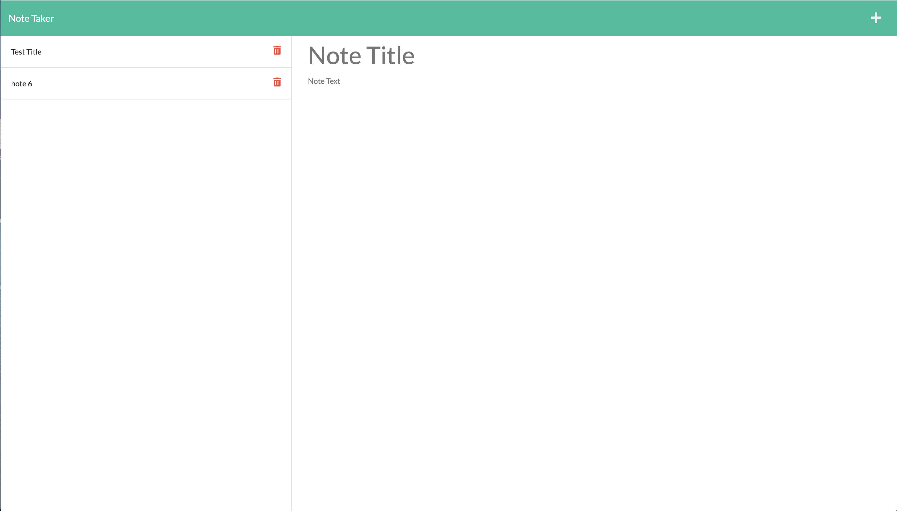

# Note taker
  ## Badges
  
  
  
  This App is open source software licensed as MIT.
  ## Table of Contents
  * [Description](https://github.com/mr2447/note-taker#description)
  * [Installation](https://github.com/mr2447/note-taker#installation)
  * [Usage](https://github.com/mr2447/note-taker#usage)
  * [Tests](https://github.com/mr2447/note-taker#tests)
  * [Credits](https://github.com/mr2447/note-taker#credits)
  * [Questions](https://github.com/mr2447/note-taker#questions)
  ## Description: 
  User will be able to write and save notes so that users can organize thoughts and keep track of tasks.
  ## Installation: 
  Run npm i
  ## Usage
  * 
  ## Credits 
  Marvin https://github.com/mr2447/note-taker
  ## Tests
  jest 
  ## Quesions?
  Reach me on gitHub or by email. 
  GitHub: mr2447
  Email: marvin.ren@yahoo.com
